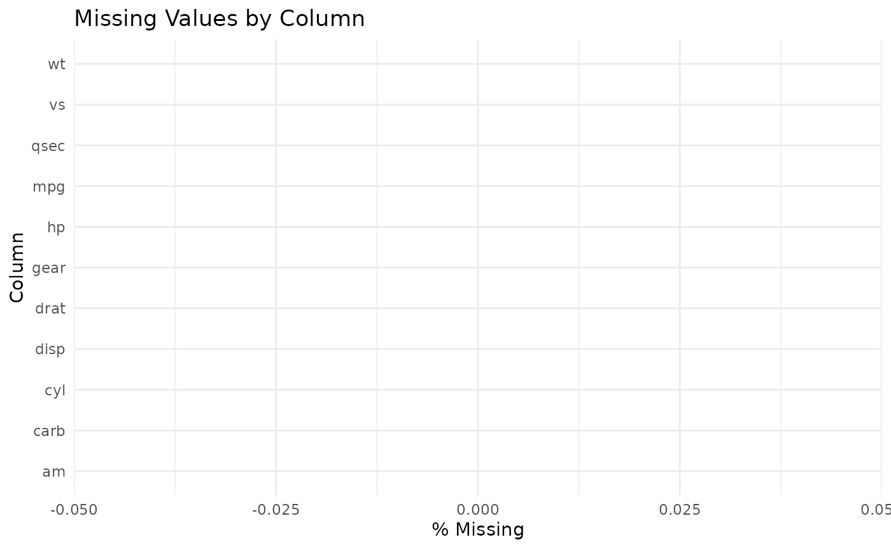

# sprintML-intro

``` r

library(sprintML)
```

## Explore

First, we can generate a rapid exploratory data analysis report to
understand the dataset:

``` r

# Using mtcars, but changing 0/1 to words so the caret package doesn't crash!
df <- mtcars
df$am <- factor(df$am, levels = c(0, 1), labels = c("Auto", "Manual"))

eda_report(df, target = "am")
#> Dataset dimensions: 32 rows x 11 columns
#> 
#> Column types:
#>       mpg       cyl      disp        hp      drat        wt      qsec        vs 
#> "numeric" "numeric" "numeric" "numeric" "numeric" "numeric" "numeric" "numeric" 
#>        am      gear      carb 
#>  "factor" "numeric" "numeric" 
#> 
#> Missing values (%):
#> named numeric(0)
#> 
#> Target class balance (am):
#> 
#>   Auto Manual 
#>  59.38  40.62
plot_missing(df)
```



``` r

model <- quick_baseline(df, target = "am")
#> Loading required package: ggplot2
#> Loading required package: lattice
#> Warning: glm.fit: fitted probabilities numerically 0 or 1 occurred
#> Warning: glm.fit: fitted probabilities numerically 0 or 1 occurred
#> Warning: glm.fit: fitted probabilities numerically 0 or 1 occurred
#> Warning: glm.fit: fitted probabilities numerically 0 or 1 occurred
#> Warning: glm.fit: fitted probabilities numerically 0 or 1 occurred
#> Warning: glm.fit: algorithm did not converge
#> Warning: glm.fit: fitted probabilities numerically 0 or 1 occurred
#> Generalized Linear Model 
#> 
#> 32 samples
#> 10 predictors
#>  2 classes: 'Auto', 'Manual' 
#> 
#> No pre-processing
#> Resampling: Cross-Validated (5 fold) 
#> Summary of sample sizes: 26, 25, 26, 25, 26 
#> Resampling results:
#> 
#>   ROC   Sens  Spec
#>   0.95  0.9   1
make_submission(model, newdata = df, id_values = 1:nrow(df), file = tempfile())
#> Submission written to: /tmp/Rtmp6HJNy2/file1ae131c3b22c
```
